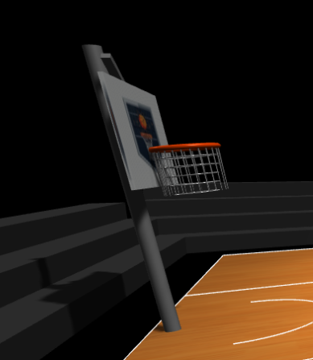

# Computer Graphics - Exercise 6

## Group Members
- Yuval Yehie 318965167
- Dana Stok 211825518

## Getting Started
1. Clone this repository to your local machine.
2. Make sure you have Node.js and npm installed.
3. Navigate to the project directory in your terminal.
4. Install dependencies: `npm install`
5. Start the local web server: `node index.js`
6. Open your browser and go to http://localhost:8000

## Implemented Features

Mandatory Interactive and Physics-Based Features 

1. Physics-Based Basketball Movement:
    - Realistic gravity simulation affecting basketball trajectory
    - Proper arc physics for basketball shots
    - Ball bouncing mechanics with energy loss
    - Ground collision detection and response
    - Hoop/rim collision detection for successful shots
2. Interactive Basketball Controls:
    - Arrow keys for horizontal basketball movement (left/right, forward/backward)
    - W/S keys for adjusting shot power (increase/decrease vertical force)
    - Spacebar to shoot the basketball
    - R key to reset the ball position to center court
3. Basketball Rotation Animations:
    - Rotation applied during ball movement and flight
    - Rotation axis aligns with movement direction
    - Speed of rotation scales with velocity
    - Smooth transition effects during rotation
4. Comprehensive Scoring System:
    - Tracks score in real-time
    - Counts shot attempts
    - Calculates shooting accuracy percentage
    - Updates score immediately upon successful shot
    - Displays visual feedback for both successful and missed shots
5. Enhanced User Interface:
    - Live scoreboard showing current score
    - Displays total attempts and shooting percentage
    - Visual shot power indicator
    - Control instructions visible on screen
    - Game messages like “SHOT MADE!” or “MISSED SHOT”
6. External Assets:
    - Sound effects for shot success/failure (can be found in source/audio)
    
## Bonus Features 
The following advanced features were implemented in addition to the required ones:

1. Multiple Hoops:
    - Shooting system supports both hoops, automatically aiming toward the nearest one.
2. Combo System:
    - Bonus points are awarded for consecutive successful shots, encouraging streaks.
3. Time Challenge Mode:
    - A countdown-based timed mode adds pressure and competitiveness.
4. Sound Effects:
    - Realistic audio cues for shooting, bouncing, and scoring enhance immersion.
5. Ball Trail Effect:
    - A visual trail follows the basketball in flight, improving shot clarity and aesthetics.

## Video (Can also be found in /video)
  [🎥 Watch Demo Video](https://drive.google.com/file/d/1CfT1OP12MGchsIzELYS-OKe2FxyfUGwU/view?usp=sharing)

# Computer Graphics - Exercise 5 - WebGL Basketball Court

## Group Members
- Yuval Yehie 318965167
- Dana Stok 211825518

## Getting Started
1. Clone this repository to your local machine.
2. Make sure you have Node.js and npm installed.
3. Navigate to the project directory in your terminal.
4. Install dependencies: `npm install`
5. Start the local web server: `node index.js`
6. Open your browser and go to http://localhost:8000

## Implemented Features
1. Mandatory Infrastructure:
- Full basketball court with:
Center circle
Center line
Three-point arcs

- Two basketball hoops with:
Transparent backboards
Orange rims at regulation height
Nets with line segments
Correct support structure positioned behind the backboard
Hoops facing each other (toward the court)

- Static basketball:
Proper orange color with black seams
Centered on court, hovering slightly
Realistic geometry

- Camera & lighting:
Directional light with shadows
Interactive OrbitControls
Toggleable with 'O' key

- Basic UI:
Score container placeholder
Control instructions container
Clean CSS styling

2. Bonus Features (Optional Infrastructure):
- Free throw lanes and arcs

- Textured surfaces for court and basketball

- Enhanced lighting configuration

- More detailed hoop models (chain nets, branded backboards)

- Stadium environment (bleachers, scoreboard including logo)

## Technical Details
- Run the server with: `node index.js`

- Access at http://localhost:8000 in your web browser

- The images must be placed in the src directory. If missing, a fallback is used.

## Screenshots

### Overall view

### Basketball hoop 1

### Basketball hoop 2

### Basketball positioned

### Camera controls functionality

